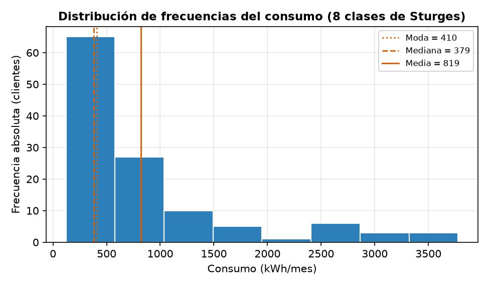
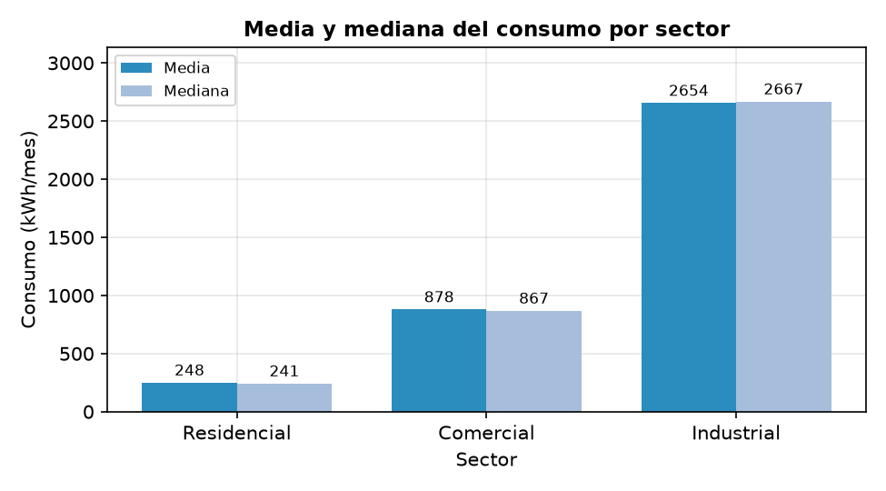
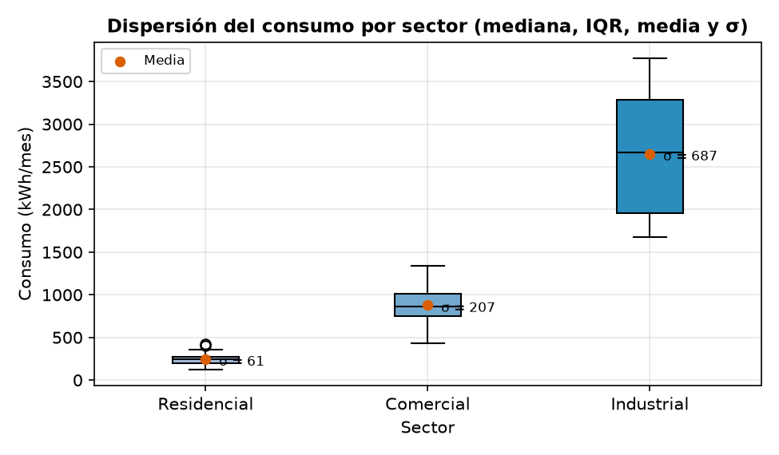

<div align="center">
    
</div>

# Análisis estadístico descriptivo del consumo energético con verificación cruzada entre Python y R

## 📋 Información General

<div align="center">
    
</div>

| Aspecto | Detalles |
|--------|----------|
| **Autor** | Andrés Giovanny Rubiano Muñoz "Andy Rubiano" |
| **Correo** | arubiano67@unisalle.edu.co |
| **Asignatura** | Ciencia de Datos |
| **Docente** | Fabián Camilo Castro Riveros |
| **Actividad** | Actividad 2 · Análisis estadístico de datos y creación de gráficos básicos |
| **Unidad** | Unidad 2 · Principios de visualización |
| **Programa** | Maestría en Inteligencia Artificial |
| **Universidad** | Universidad de La Salle |
| **Líneas de Trabajo** | Estadística Descriptiva y Principios de Visualización |
| **Año** | 2026 |
| **Estado** | Completado |

---

## 🎯 Descripción del Proyecto

La estadística descriptiva es la primera etapa de todo análisis de datos: organiza, resume y caracteriza un conjunto de observaciones mediante tres familias de instrumentos complementarios —**distribuciones de frecuencia**, **medidas de tendencia central** y **medidas de dispersión**—.

Este informe aplica esos tres instrumentos al consumo energético mensual (kWh) de **120 clientes** repartidos en tres sectores con escalas muy distintas, y acompaña **cada cálculo con el gráfico básico que lo representa**: histograma, polígono de frecuencias, ojiva, diagrama de barras y diagrama de caja.

El resultado se desarrolla **en paralelo en dos entornos**:

- **Python** — `pandas` + `Matplotlib` como herramienta principal, donde el cálculo y su representación conviven en el mismo script.
- **R base** — `mean`, `median`, `var`, `sd` e `hist` como **verificación cruzada independiente**, sin dependencias externas.

La comparación es directa porque `var()` y `sd()` de R son muestrales (divisor *n* − 1), exactamente como el parámetro `ddof=1` de pandas: los resultados deben coincidir **dígito a dígito**.

### El hallazgo central

> La media global (**819,1 kWh**) duplica con creces a la mediana (**378,6 kWh**). Esa discrepancia no obedece a errores ni a valores atípicos, sino a la **coexistencia de tres poblaciones de escalas diferentes**, y solo se hace evidente cuando se leen de forma conjunta la tabla de frecuencias, la relación entre las tres medidas de tendencia central y el histograma.

### Objetivos Principales

- Construir la distribución de frecuencias del consumo mediante la regla de Sturges, con frecuencias absolutas, acumuladas, relativas y relativas acumuladas.
- Calcular las medidas de tendencia central (media, mediana y moda interpolada por clase modal) por sector y a nivel global.
- Calcular las medidas de dispersión (rango, varianza, desviación estándar, coeficiente de variación e IQR) en los mismos niveles.
- Producir los gráficos básicos que representan cada cálculo, aplicando los principios de diseño de la Unidad 2.
- Verificar de forma independiente todos los estadísticos con R base y replicar las figuras con su graficación nativa.
- Entregar el informe escrito aplicando la normativa IEEE.

---

## 📚 Estructura del Repositorio

```
.
├── main.tex                          # Documento principal (preámbulo + \input de secciones y apéndices)
├── IEEEtran.cls                      # Clase LaTeX del formato IEEE conference
├── README.md                         # Este archivo
├── assets/
│   └── images/
│       ├── Logo.png                  # Logo institucional (marca de agua)
│       ├── author/                   # Fotografía del autor
│       └── figures/                  # Figuras generadas por los scripts
│           ├── python/               # Producidas por statistics.py (Matplotlib)
│           │   ├── hist_sturges_central_tendency.png   # Histograma + media, mediana y moda
│           │   ├── freq_polygon_ogive.png              # Polígono de frecuencias + ojiva
│           │   ├── bar_freq_by_sector.png              # Frecuencia de clientes por sector
│           │   ├── bar_mean_median_by_sector.png       # Media vs. mediana por sector
│           │   └── boxplot_dispersion_by_sector.png    # Diagrama de caja con media y σ
│           └── r/                    # Réplicas independientes de statistics.R (graficación base)
│               └── (mismos cinco nombres de archivo)
├── src/
│   ├── sections/                     # Secciones del informe (en orden de compilación)
│   │   ├── introduction/             # I. Introducción
│   │   ├── fundamentals/             # II. Conceptos fundamentales del análisis estadístico
│   │   ├── methodology/              # III. Metodología (incluye herramientas y entorno)
│   │   ├── results/                  # IV. Resultados
│   │   └── conclusions/              # V. Conclusiones
│   └── appendices/
│       ├── python-code/              # Apéndice A: código completo en Python
│       └── r-code/                   # Apéndice B: código completo en R
├── utils/
│   ├── codes/
│   │   └── full/                     # Scripts completos, citados vía \lstinputlisting
│   │       ├── statistics.py                  # Anexo A · Código en Python
│   │       └── statistics.R                   # Anexo B · Código en R
│   └── references/
│       └── references.bib            # Bibliografía IEEE (12 referencias)
└── build/                            # Artefactos de compilación LaTeX (generado)
```

> ℹ️ Los scripts, el dataset y las figuras se generan en el proyecto hermano [`visualizations`](../visualizations); este repositorio contiene únicamente el informe y las copias citadas desde él.

### Estructura del informe

| # | Sección | Contenido |
|---|---|---|
| — | Resumen y palabras clave | Cifras principales del estudio |
| I | Introducción | Las tres familias de instrumentos, propósito del laboratorio y anticipo del hallazgo central |
| II | Conceptos fundamentales | Distribución de frecuencias, tendencia central y dispersión — **7 ecuaciones** numeradas |
| III | Metodología | Herramientas y entorno, conjunto de datos (**Tabla I**), flujo de trabajo y decisiones de implementación en ambos entornos |
| IV | Resultados | Distribución de frecuencias, tendencia central, dispersión y verificación cruzada — **Tablas II–V** y **Figuras 1–4** |
| V | Conclusiones | Seis conclusiones respaldadas por las cifras de la ejecución |
| A | Anexo · Código en Python | `statistics.py` completo |
| B | Anexo · Código en R | `statistics.R` completo |
| — | Referencias | 12 entradas en formato IEEE |

**El cuerpo del informe no lleva listados de código.** La metodología describe cada decisión de implementación y remite a los Anexos A y B, donde ambos scripts se reproducen íntegros y en su orden de ejecución, con los bloques correspondiéndose uno a uno con las subsecciones de la metodología.

---

## 🧪 Metodología

### Fase 1 · Conjunto de datos

Se emplea un dataset **simulado** de consumo energético mensual de 120 clientes de una empresa distribuidora, generado con **semilla fija (42)** para que las observaciones se regeneren de forma idéntica en cada ejecución.

| Variable | Tipo | Descripción |
|---|---|---|
| `cliente_id` | Nominal | Identificador único (CL-001 a CL-120) |
| `sector` | Nominal | Residencial, Comercial o Industrial |
| `consumo_kwh` | Cuantitativa continua | Consumo mensual en kilovatios-hora |
| `costo_miles_cop` | Cuantitativa continua | Facturación mensual en miles de COP |

| Sector | Probabilidad | Media base (kWh) | Desviación (kWh) | Tarifa (COP/kWh) |
|---|---|---|---|---|
| Residencial | 0,50 | 250 | 60 | 820 |
| Comercial | 0,30 | 900 | 220 | 710 |
| Industrial | 0,20 | 2.500 | 600 | 640 |

> ℹ️ El carácter simulado es una **ventaja metodológica**: al saber de antemano que existen tres poblaciones con medias separadas, es posible evaluar si cada estadístico y cada gráfico revela u oculta esa estructura.

### Fase 2 · Distribución de frecuencias

El número de clases se obtiene con la **regla de Sturges**, *k* = 1 + 3,322 · log₁₀(*n*). Con *n* = 120 resultan **8 clases** de amplitud constante (457,0 kWh) sobre el recorrido de 121,2 a 3.777,1 kWh.

### Fase 3 · Medidas de tendencia central

La media y la mediana salen directamente de pandas. La **moda** exige tratamiento aparte: sobre una variable continua ningún valor se repite, así que se localiza la **clase modal** y se interpola dentro de ella con *M<sub>o</sub>* = *L* + *d₁*/(*d₁* + *d₂*) · *w*. El cálculo se repite por sector **recomputando sus propias clases de Sturges** — un grupo de 18 observaciones no admite las mismas ocho clases que el conjunto completo.

### Fase 4 · Medidas de dispersión

Rango, varianza, desviación estándar, coeficiente de variación e IQR, con `ddof=1` explícito para obtener los estimadores **muestrales**, que son justamente los que R implementa por defecto.

### Fase 5 · Gráficos básicos

Principios de diseño aplicados en todas las figuras: título informativo, ejes con unidades, eje de frecuencias desde cero, **cuadrícula sutil detrás de los datos**, color funcional y etiquetas de datos.

### Fase 6 · Verificación cruzada en R

El script de R **no reutiliza ningún resultado de Python**: lee el mismo CSV y vuelve a calcular desde cero la tabla de frecuencias y todos los estadísticos, de modo que cualquier discrepancia revelaría un error de implementación.

---

## 📊 Resultados

### Distribución de frecuencias

Antes de leer las frecuencias conviene saber **quién ocupa cada clase**: los tres sectores cubren franjas de consumo que apenas se solapan (Residencial 121,2–424,8; Comercial 430,9–1.339,3; Industrial 1.674,0–3.777,1 kWh), así que cada clase resulta casi de un solo sector.

| Clase (kWh) | Resid. | Comer. | Indus. | Clientes |
|---|---|---|---|---|
| [121,2 – 578,2) | 62 | 3 | – | 65 |
| [578,2 – 1.035,2) | – | 27 | – | 27 |
| [1.035,2 – 1.492,2) | – | 10 | – | 10 |
| [1.492,2 – 1.949,2) | – | – | 5 | 5 |
| [1.949,2 – 2.406,1) | – | – | 1 | 1 |
| [2.406,1 – 2.863,1) | – | – | 6 | 6 |
| [2.863,1 – 3.320,1) | – | – | 3 | 3 |
| [3.320,1 – 3.777,1] | – | – | 3 | 3 |
| **Total** | **62** | **40** | **18** | **120** |

Sobre esas mismas clases se construye la distribución de frecuencias completa:

| Clase (kWh) | Marca | *fᵢ* | *Fᵢ* | *hᵢ* (%) | *Hᵢ* (%) |
|---|---|---|---|---|---|
| [121,2 – 578,2) | 349,7 | **65** | 65 | **54,2** | 54,2 |
| [578,2 – 1.035,2) | 806,7 | 27 | 92 | 22,5 | **76,7** |
| [1.035,2 – 1.492,2) | 1.263,7 | 10 | 102 | 8,3 | 85,0 |
| [1.492,2 – 1.949,2) | 1.720,7 | 5 | 107 | 4,2 | 89,2 |
| [1.949,2 – 2.406,1) | 2.177,6 | **1** | 108 | **0,8** | 90,0 |
| [2.406,1 – 2.863,1) | 2.634,6 | 6 | 114 | 5,0 | 95,0 |
| [2.863,1 – 3.320,1) | 3.091,6 | 3 | 117 | 2,5 | 97,5 |
| [3.320,1 – 3.777,1] | 3.548,6 | 3 | 120 | 2,5 | 100,0 |

La primera clase concentra el **54,2 %** de los clientes y las dos primeras acumulan el **76,7 %**. El **vacío entre 1.949,2 y 2.406,1 kWh** —una sola observación— es la huella de la estructura sectorial: separa a los clientes comerciales más altos de los industriales e indica que no se trata de una única población con cola larga, sino de **grupos con escalas distintas**.

<div align="center">
    
</div>

<p align="center"><em>La mediana y la moda permanecen en la zona de mayor densidad; la media es arrastrada hacia la derecha hasta una región donde apenas hay observaciones.</em></p>

### Medidas de tendencia central

| Grupo | *n* | Media | Mediana | Moda interpolada |
|---|---|---|---|---|
| Residencial | 62 | 248,3 | 240,6 | 232,7 |
| Comercial | 40 | 878,1 | 866,6 | 787,8 |
| Industrial | 18 | 2.654,0 | 2.666,8 | 1.849,3 |
| **Global** | **120** | **819,1** | **378,6** | **409,6** |

**Dentro de cada sector, media y mediana casi coinciden** — señal de distribuciones simétricas. **A nivel global la media duplica con creces a la mediana**, no por valores atípicos sino porque el promedio mezcla tres poblaciones de escalas distintas.

> ⚠️ **La media global no describe a ningún cliente típico.** Todo análisis operativo del consumo debe segmentarse por sector antes de promediar.

La moda de la variable nominal `sector` es **Residencial**, con 62 de los 120 clientes (52 %).

<div align="center">
    
</div>

<p align="center"><em>La casi igualdad de las parejas de barras dentro de cada grupo hace visible la simetría local, pese a la asimetría global de la distribución.</em></p>

### Medidas de dispersión

| Grupo | Rango | Varianza | *s* | CV (%) | IQR |
|---|---|---|---|---|---|
| Residencial | 303,6 | 3.736,3 | 61,1 | 24,6 | 69,5 |
| Comercial | 908,4 | 42.989,5 | 207,3 | 23,6 | 255,3 |
| Industrial | 2.103,1 | 471.785,8 | 686,9 | 25,9 | 1.322,8 |
| **Global** | **3.655,9** | **763.564,7** | **873,8** | **106,7** | **742,0** |

Tres deducciones:

1. **La dispersión absoluta crece con la escala del sector** — *s* pasa de 61,1 a 686,9 kWh y la varianza amplifica esa brecha en dos órdenes de magnitud.
2. **La dispersión relativa es homogénea** — el CV se mantiene entre 23,6 % y 25,9 % en los tres sectores: cada grupo es igualmente variable en proporción a su media.
3. **El CV global (106,7 %) cuadruplica al de cualquier sector** — esa explosión no proviene de la dispersión interna de los grupos, sino de la **distancia entre sus centros**. Es la evidencia numérica de que el conjunto global es una mezcla de poblaciones, coherente con el vacío de la tabla de frecuencias y con la separación sin traslape de las cajas.

<div align="center">
    
</div>

<p align="center"><em>Cajas y bigotes progresivamente más amplios, sin traslape entre sectores: la brecha de escala se aprecia de un solo vistazo.</em></p>

### Verificación cruzada Python ↔ R

R recalculó de forma independiente la tabla de frecuencias completa —las mismas ocho clases— y **todos los estadísticos coinciden dígito a dígito**, incluida la moda interpolada por clase modal. La equivalencia entre `var()`/`sd()` de R y el parámetro `ddof=1` de pandas explica la coincidencia exacta de las varianzas muestrales.

<div align="center">
    
</div>

<p align="center"><em>Réplica en R del polígono y la ojiva. La cuadrícula se traza en dos pasadas para mantenerla detrás de los datos, conservando el principio de diseño.</em></p>

**El análisis descriptivo y sus principios de representación son independientes de la herramienta empleada.**

---

## ⚙️ Requisitos

### Para compilar el documento LaTeX

- **Distribución LaTeX:** TeX Live, MiKTeX o MacTeX (LaTeX 2024+)
- **Compilador:** `pdflatex` o `latexmk` (recomendado)
- **Editor recomendado:** VS Code (con extensión LaTeX Workshop), TeXstudio u Overleaf

Paquetes del preámbulo, todos incluidos en cualquier distribución completa:

| Paquete | Para qué |
|---|---|
| `babel` (spanish) | Idioma, guionado y etiquetas |
| `amsmath`, `amssymb`, `amsfonts` | Las 7 ecuaciones y `\text{}` dentro de modo matemático |
| `graphicx` | Inclusión de las 10 imágenes |
| `array` | Columna `p{}` con `\raggedright` en la Tabla I |
| `listings` + `xcolor` | Resaltado de los dos scripts en los anexos |
| `float` | Especificador `[H]` en las tablas |
| `cuted` + `capt-of` | Entorno `strip` y `\captionof` — tres de las cuatro figuras a doble columna |
| `tcolorbox` | Recuadros destacados — cargado de reserva |
| `eso-pic` + `transparent` | Marca de agua institucional |
| `hyperref` | Enlaces y anclas del PDF (**se carga de último**) |

### Para ejecutar los scripts

Los scripts viven en el proyecto hermano [`visualizations`](../visualizations).

| Entorno | Dependencias |
|---|---|
| Python | `numpy`, `pandas`, `matplotlib` |
| R | Base — `stats` y `graphics`, sin paquetes externos |

---

## 🛠️ Compilación del Documento

### Opción 1: `latexmk` (recomendado)

```bash
latexmk -pdf -outdir=build main.tex
```

Resuelve referencias cruzadas y bibliografía en una sola invocación.

> ⚠️ BibTeX se ejecuta con el directorio de trabajo en `build/`, así que la ruta relativa `utils/references/references.bib` no se resuelve sola. Si aparece `I couldn't open database file`, exporta `BIBINPUTS` apuntando a la raíz del proyecto antes de compilar:
>
> ```bash
> BIBINPUTS=".:..:$PWD:" latexmk -pdf -outdir=build main.tex
> ```

### Opción 2: `pdflatex` manual

```bash
pdflatex -output-directory=build main.tex
bibtex build/main
pdflatex -output-directory=build main.tex
pdflatex -output-directory=build main.tex
```

### Limpiar artefactos temporales

```bash
latexmk -c -outdir=build
```

---

## 🎨 Configuración del Documento

### Listings con resaltado para Python y R

El preámbulo de [`main.tex`](main.tex) configura un `\lstset` común con la paleta del documento, numeración de líneas y `breaklines=true`, y sobre él define **dos estilos por lenguaje**:

```latex
\lstdefinestyle{python}{language=Python, morekeywords={np, plt, pd, ax, fig, Path}}
\lstdefinestyle{rlang}{language=R, morekeywords={png, dev, par, grid, ...}}
```

Uso desde los apéndices:

```latex
\lstinputlisting[style=python]{utils/codes/full/statistics.py}
\lstinputlisting[style=rlang]{utils/codes/full/statistics.R}
```

> ℹ️ **El código va íntegro al final, en los apéndices.** El cuerpo del informe queda libre de listados: la metodología describe las decisiones de implementación y remite a los Anexos A y B, donde cada script se reproduce completo y en su orden de ejecución. Así el hilo argumental —tabla, figura, interpretación— no se interrumpe cada dos párrafos con media página de código.

El bloque `literate` cubre tildes, `ñ`/`Ñ`, el símbolo de grado y **los dos caracteres matemáticos que aparecen en el código fuente**: `σ` (etiqueta del diagrama de caja) y `≈` (leyenda de la ojiva). Sin esas entradas, `inputenc` falla al procesar los `.py`.

### Símbolo de porcentaje dentro de ecuaciones

`babel` con opción `spanish` redefine `\%` mediante `\es@sppercent`, que inspecciona `\lastskip` para decidir el espaciado. En modo matemático el último *skip* es un `muskip`, lo que provoca el error `Incompatible glue units`:

```latex
% ✗ falla:  CV = \frac{s}{\bar{x}} \times 100\,\%
% ✓ correcto:
CV = \frac{s}{\bar{x}} \times 100\,\text{\%}
```

Envolverlo en `\text{}` (de `amsmath`) devuelve el comando a modo texto, donde `\lastskip` es una *glue* normal. En modo texto corriente, `50\,\%` funciona sin problema.

### Tablas con columnas de ancho fijo

La columna *Descripción* de la Tabla I mide 3,1 cm. A ese ancho el justificado por defecto de `p{}` no encuentra puntos de corte razonables y LaTeX emite `Underfull \hbox (badness 10000)` en casi todas las filas, además de dejar huecos visibles entre palabras. La solución es alinear a la izquierda con el especificador de columna del paquete `array`:

```latex
\usepackage{array}
...
\begin{tabular}{|l|l|>{\raggedright\arraybackslash}p{3.1cm}|}
```

`\arraybackslash` es obligatorio: `\raggedright` redefine `\\`, y sin restaurarlo el salto de fila de la tabla deja de funcionar dentro de esa columna.

### Etiquetas en español

`babel` con opción `spanish` reasigna `\tablename` a *Cuadro* al iniciar el documento, por lo que un `\renewcommand` en el preámbulo **no basta**: la redefinición debe inyectarse dentro de `\captionsspanish`.

```latex
\addto\captionsspanish{%
    \renewcommand{\tablename}{Tabla}%
    \renewcommand{\lstlistingname}{Código}%
}
```

| Comando original | Etiqueta personalizada |
|---|---|
| `\tablename` | `Tabla` (en vez del default español `Cuadro`) |
| `\lstlistingname` | `Código` (en vez de `Listing`) |
| `\refname` | `Referencias` |

### Marca de agua institucional

Aparece en **todas las páginas**, dibujada en la capa de fondo (`\AddToShipoutPictureBG` de `eso-pic`), por lo que queda por detrás del texto y de las figuras. Está controlada por el flag `\ifshowwatermark` definido en [`main.tex`](main.tex); basta cambiar `\showwatermarktrue` por `\showwatermarkfalse` para desactivarla sin tocar nada más.

```latex
\newif\ifshowwatermark
\showwatermarktrue
\AddToShipoutPictureBG{%
    \ifshowwatermark
        \AtPageCenter{%
            \makebox(0,0){%
                \transparent{0.18}%
                \includegraphics[width=1.0\textwidth]{assets/images/Logo}%
            }%
        }%
    \fi
}
```

Parámetros ajustables: `\transparent{0.18}` (opacidad) y `width=...` del `\includegraphics` (tamaño). Los bloques de código tienen fondo opaco propio, así que recortan la marca en esas zonas.

### Orden de carga de paquetes

`hyperref` se carga **de último** en el preámbulo. Cargado antes que `float` y `capt-of`, duplica el ancla PDF de los floats y pdfTeX emite `destination with the same identifier` en cada compilación.

### Figuras Python + R en bloques a doble columna

Cada figura del informe presenta **la versión de Matplotlib junto a su réplica independiente en R** bajo un mismo pie, de modo que ambas comparten número y el lector las compara sin saltar de página. Tres de las cuatro figuras se maquetan con el entorno `strip` de `cuted`, que inserta un bloque **a doble columna en su posición literal, sin flotar**:

```latex
\clearpage

\begin{strip}
    \centering
    \includegraphics[width=0.86\linewidth]{assets/images/figures/python/freq_polygon_ogive.png}

    \vspace{6pt}

    \includegraphics[width=0.86\linewidth]{assets/images/figures/r/freq_polygon_ogive.png}

    \vspace{4pt}

    \captionof{figure}{...en Matplotlib (arriba) y su réplica en R (abajo)}
    \label{polygon_ogive}
\end{strip}
```

En `strip`, `\linewidth` es el **ancho de texto completo**, no el de columna, y el pie se escribe con `\captionof{figure}{...}` (de `capt-of`) porque el entorno no es un flotante y `\caption` no funcionaría allí.

| Figura | Entorno | Disposición | Nota |
|---|---|---|---|
| `hist_sturges` | `strip` | Python izquierda · R derecha | Cada panel a `0.49\textwidth` dentro de un `minipage` |
| `polygon_ogive` | `strip` + `\clearpage` | Python arriba · R abajo | Paneles de 2,65:1, ilegibles a una sola columna |
| `bar_sector` | `strip` + `\clearpage` | Rejilla 2×2 | Fusiona frecuencia por sector (izquierda) y media/mediana (derecha) en **una sola figura** |
| `boxplot_dispersion` | `figure[!htbp]` | Python arriba · R abajo | Única figura que cabe holgada en una columna |

Tres advertencias sobre `strip`, aprendidas a golpes:

> ⚠️ **No se parte entre páginas.** Si el bloque no cabe en lo que queda, se corta en silencio contra el borde inferior. Por eso las figuras altas llevan un `\clearpage` **inmediatamente antes**.

> ⚠️ **Se traga los `\write` pendientes de la página.** Todo `\label` que quede *encima* del `strip` en la misma página desaparece del `.aux` y su `\ref` queda sin resolver — le ocurrió a `central_tendency`, cuya Tabla IV precedía al bloque. La solución es abrir la página con el `strip` (`\clearpage` delante, texto explicativo debajo), de forma que no haya material previo que perder.

> ⚠️ **Exige revisión visual tras cada edición grande**, porque no flota: se queda exactamente donde está en el `.tex`, sin reacomodarse como haría un `figure*`.

> ℹ️ La alternativa estándar es `figure*[t]`, el flotante de doble columna de IEEE, que no sufre ninguno de los dos primeros problemas. Se descartó porque sube al tope de la página **siguiente** y las figuras terminaban a dos páginas del párrafo que las comenta.

### Autor repetido en la bibliografía

Las referencias [5] y [8] son material de la asignatura y comparten autor. Por defecto `IEEEtran.bst` sustituye el nombre repetido por una raya (`——`) en la segunda entrada. Para imprimir el nombre completo en ambas se usa la entrada de control del propio estilo, declarada en [`references.bib`](utils/references/references.bib):

```bibtex
@IEEEtranBSTCTL{IEEEtran:BSTcontrol,
  CTLdash_repeated_names = "no",
}
```

y activada al inicio de [`main.tex`](main.tex):

```latex
\bstctlcite{IEEEtran:BSTcontrol}
```

`\bstctlcite` es una cita que no imprime nada: la entrada de control no aparece en la lista de referencias ni consume número. Debe ejecutarse antes de la primera cita real del documento.

### Convención de etiquetas (`\label`)

Nombres descriptivos en `snake_case`, sin prefijo de tipo:

| Elemento | Ejemplos |
|---|---|
| Tablas | `dataset_variables`, `class_sector`, `freq_table`, `central_tendency`, `dispersion` |
| Figuras | `hist_sturges`, `polygon_ogive`, `bar_sector`, `boxplot_dispersion` |
| Ecuaciones | `sturges`, `moda_interpolada`, `rango`, `varianza`, `desviacion`, `cv`, `iqr` |
| Apéndices | `anexo_python`, `anexo_r` |

---

## 📋 Estado del Documento

El informe está **terminado**: compila en 11 páginas sin desbordes de caja y sin referencias ni citas sin resolver; todas las figuras, tablas y ecuaciones están referenciadas desde el texto.

### ✅ Completado

#### Secciones
- ✅ **Resumen** — con las cifras principales del estudio
- ✅ **Introducción** — las tres familias de instrumentos, propósito del laboratorio y anticipo del hallazgo central
- ✅ **Conceptos fundamentales** — distribución de frecuencias con la regla de Sturges, medidas de tendencia central con la moda interpolada y medidas de dispersión
- ✅ **Metodología** — herramientas y entorno de trabajo, conjunto de datos, flujo de trabajo y reproducibilidad, y las decisiones de implementación de cada familia de medidas en Python y en R, con remisión a los anexos
- ✅ **Resultados** — distribución de frecuencias, tendencia central, dispersión y verificación cruzada
- ✅ **Conclusiones** — seis conclusiones respaldadas por las cifras de la ejecución

#### Apéndices
- ✅ **Anexo A** — código completo en Python (`statistics.py`), en su orden de ejecución
- ✅ **Anexo B** — código completo en R (`statistics.R`), con los mismos bloques que el Anexo A

#### Infraestructura
- ✅ 2 scripts completos en `utils/codes/full/`, reproducidos íntegros en los apéndices (el cuerpo del informe no lleva listados)
- ✅ 10 imágenes (5 gráficos × 2 entornos) repartidas en 4 figuras, todas referenciadas desde el texto
- ✅ 5 tablas con las cifras reales de la ejecución
- ✅ 7 ecuaciones numeradas y referenciadas desde el texto
- ✅ Bibliografía IEEE (12 referencias en `utils/references/references.bib`)
- ✅ Etiquetas en español (Tabla, Código) vía `\captionsspanish`
- ✅ Marca de agua institucional en todas las páginas, con flag de activación
- ✅ Resaltado de sintaxis diferenciado para Python y R
- ✅ Compilación sin `Overfull` ni `Underfull \hbox`/`\vbox`

---

## 📖 Guía de Estilo

| Aspecto | Valor |
|---|---|
| Idioma | Español |
| Formato | IEEE conference (`IEEEtran`, dos columnas) |
| Tamaño de página | Carta (8.5" × 11") |
| Fuente base | 10 pt |
| Bibliografía | IEEE |
| Extensión | 11 páginas |

---

## 🔑 Palabras Clave

`Coeficiente de Variación` · `Diagrama de Caja` · `Distribución de Frecuencias` · `Estadística Descriptiva` · `Histograma` · `Matplotlib` · `Medidas de Dispersión` · `Medidas de Tendencia Central` · `Ojiva` · `pandas` · `Principios de Visualización` · `R` · `Regla de Sturges`

---

## 🔗 Recursos

- [Proyecto hermano `visualizations` — scripts, dataset y figuras](../visualizations)
- [Documentación de Matplotlib](https://matplotlib.org/stable/)
- [Documentación de pandas](https://pandas.pydata.org/docs/)
- [Documentación de NumPy](https://numpy.org/doc/stable/)
- [The R Project for Statistical Computing](https://www.R-project.org/)
- [Data Science: A First Introduction with Python](https://python.datasciencebook.ca/)
- [Documentación LaTeX](https://www.latex-project.org/)
- [Paquete listings](https://www.ctan.org/pkg/listings)

---

## 📧 Contacto

**Andrés Giovanny Rubiano Muñoz**
Maestría en Inteligencia Artificial · Universidad de La Salle
arubiano67@unisalle.edu.co

---

## 📄 Derechos Reservados

© 2026 Andrés Giovanny Rubiano Muñoz (Andy Rubiano). Todos los derechos reservados.

Este trabajo académico y su contenido —investigación, código, metodologías y documentación— son propiedad intelectual conjunta de:

- **Andrés Giovanny Rubiano Muñoz** (Andy Rubiano) — Autor
- **Universidad de La Salle** — Institución académica

El uso, reproducción o distribución requiere autorización previa escrita de los titulares de derechos.

---

<div align="center">
  Universidad de La Salle | Bogotá D. C., Colombia
</div>
