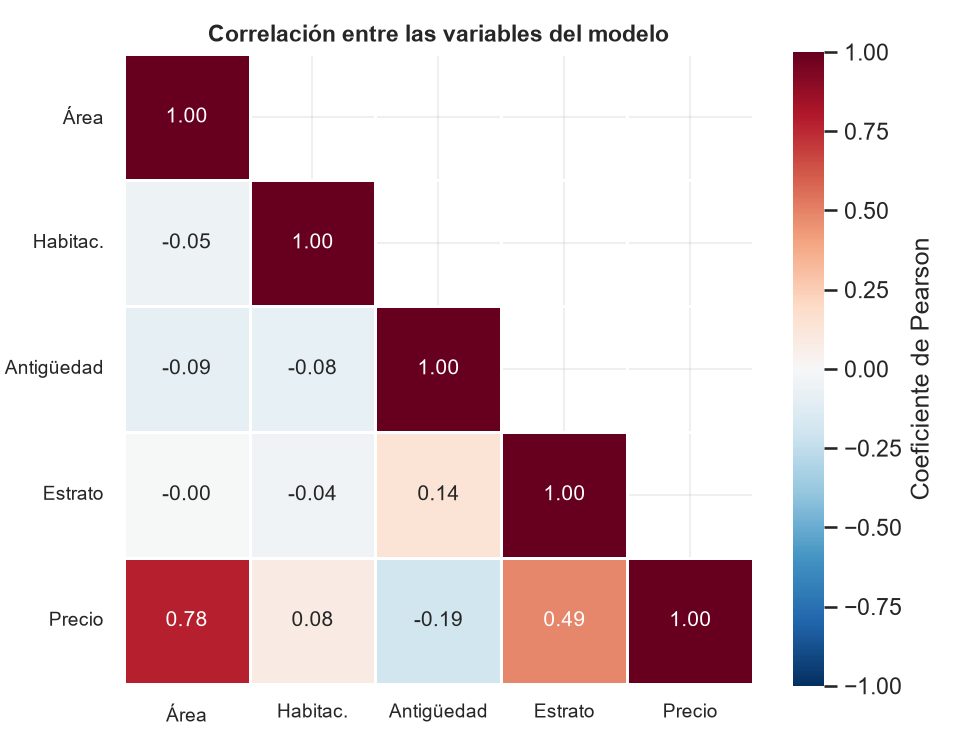

<div align="center">
    
</div>

# Análisis de regresión y visualización avanzada

## 📋 Información General

<div align="center">
    
</div>

| Aspecto | Detalles |
|--------|----------|
| **Autor** | Andrés Giovanny Rubiano Muñoz "Andy Rubiano" |
| **Correo** | arubiano67@unisalle.edu.co |
| **Asignatura** | Ciencia de Datos |
| **Docente** | Fabián Camilo Castro Riveros |
| **Actividad** | Actividad 4 · Análisis de Regresión y Visualización Avanzada |
| **Unidad** | Unidad 2 · Herramientas de visualización avanzada |
| **Programa** | Maestría en Inteligencia Artificial |
| **Universidad** | Universidad de La Salle |
| **Líneas de Trabajo** | Regresión Lineal, Diagnóstico de Supuestos y Visualización Avanzada |
| **Año** | 2026 |
| **Estado** | Completado |

---

## 🎯 Descripción del Proyecto

Este repositorio contiene **el informe en LaTeX** (formato IEEE conference) del laboratorio de regresión y visualización avanzada.

Una recta que explica el 99,7 % de la variabilidad parece un resultado difícil de mejorar. El informe muestra que ese número, por sí solo, **no dice si el modelo es correcto**: la misma regresión que alcanza un coeficiente de determinación de 0,9969 deja residuos que no son ruido, sino que se ordenan según una variable que quedó fuera del modelo. Detectar esa estructura, incorporarla y verificar que el modelo corregido cumple los supuestos que sostienen su inferencia es el recorrido completo del trabajo.

El análisis se apoya en el conjunto de datos simulado del consumo energético mensual de **120 clientes** de una empresa distribuidora (sectores Residencial, Comercial e Industrial, semilla fija 42). Que sea simulado es una **ventaja metodológica**: se sabe de antemano que existen tres poblaciones con tarifas medias distintas, de modo que el modelo puede evaluarse por su capacidad de recuperar una estructura conocida y no solo por su ajuste.

### Los tres hallazgos

> **Los coeficientes tienen nombre.** Las pendientes del modelo múltiple son las tarifas de cada sector —**791,6**, **704,8** y **671,0** COP/kWh— y reproducen con menos del 4 % de diferencia el cociente entre costo y consumo calculado sin pasar por la regresión.

> **La mejora se sostiene fuera de la muestra.** La validación cruzada de diez pliegues reduce el error un **16,7 %** frente al modelo simple, y sobre 36 clientes nunca vistos alcanza R² = 0,9944 con un MAPE del 3,68 %.

> **El descuento por escala es el hallazgo de negocio.** El sector Industrial paga **121 COP/kWh menos** que el Residencial y el Comercial 87 menos, cifras que la empresa puede contrastar contra su política tarifaria.

### Objetivos Principales

- Cuantificar la asociación entre consumo y costo con los coeficientes de Pearson y de Spearman, global y por sector.
- Estimar una regresión lineal simple y **someterla a las cuatro pruebas de supuestos** que sostienen su inferencia.
- Corregir la especificación incorporando el sector y su interacción con el consumo, y seleccionar entre los tres modelos con criterios que no se dejan engañar por R².
- Medir la capacidad predictiva sobre datos no vistos con partición estratificada y validación cruzada.
- Construir visualizaciones que **formen parte del método** y no lo ilustren, incluidas dos piezas interactivas.
- Verificar todo el cálculo con una implementación independiente en R.
- Entregar el informe escrito aplicando la normativa IEEE.

---

## 📚 Estructura del Repositorio

```
.
├── main.tex                          # Documento principal (preámbulo + \input de secciones y apéndices)
├── IEEEtran.cls                      # Clase LaTeX del formato IEEE conference
├── README.md                         # Este archivo
├── assets/
│   └── images/
│       ├── Logo.png                  # Logo institucional (marca de agua)
│       ├── author/                   # Fotografía del autor
│       └── figures/                  # Figuras generadas por los scripts
│           ├── python/
│           │   ├── regression/       # Fases 1-3 (Matplotlib) — 7 figuras
│           │   │   ├── dispersion_ajuste_simple.png    # Fig. 3  · ajuste MCO con bandas
│           │   │   ├── diagnostico_simple.png          # Fig. 4  · panel de diagnóstico
│           │   │   ├── residuos_por_sector.png         # Fig. 5  · sesgo por sector
│           │   │   ├── ajuste_por_sector.png           # Fig. 6  · M3 frente a M1
│           │   │   ├── coeficientes_ic.png             # Fig. 7  · coeficientes con IC
│           │   │   ├── comparacion_modelos.png         # Fig. 8  · tres criterios
│           │   │   └── real_vs_predicho.png            # Fig. 9  · prueba retenida
│           │   ├── advanced/         # Fase 4 (seaborn) — 4 figuras
│           │   │   ├── sns_heatmap_correlacion.png     # Fig. 1  · matriz de correlaciones
│           │   │   ├── sns_matriz_dispersion.png       # Fig. 2  · matriz de dispersión
│           │   │   ├── sns_lmplot_sectores.png         # Fig. 10 · una regresión por sector
│           │   │   └── sns_residuos_lowess.png         # Fig. 11 · residuos con lowess
│           │   └── dashboard/        # Fase 4 (Plotly) — capturas de las piezas interactivas
│           │       ├── dashboard_regresion.png         # Fig. 12 · tablero de cuatro paneles
│           │       └── scatter_interactivo.png         # Fig. 13 · dispersión interactiva
│           └── r/
│               └── regression/       # Fase 5 (ggplot2 y graficación base) — 3 figuras
│                   ├── ggplot_ajuste_por_sector.png    # Fig. 14 · regresión por sector
│                   ├── ggplot_residuos_por_sector.png  # Fig. 15 · sesgo verificado en R
│                   └── base_diagnostico_m1.png         # Fig. 16 · plot(modelo) canónico
├── src/
│   ├── sections/                     # Secciones del informe (en orden de compilación)
│   │   ├── introduction/             # I. Introducción
│   │   ├── methodology/              # II. Metodología
│   │   ├── results/                  # III. Resultados
│   │   └── conclusions/              # IV. Conclusiones
│   └── appendices/
│       ├── python-code/              # Apéndice A: los cinco scripts de Python
│       └── r-code/                   # Apéndice B: el script de R
├── utils/
│   ├── codes/                        # Copias sin comentarios, citadas vía \lstinputlisting
│   │   ├── python/
│   │   │   ├── dataset.py                     # Fase 0
│   │   │   ├── simple_regression.py           # Fase 1
│   │   │   ├── multiple_regression.py         # Fase 2
│   │   │   ├── ml_regression.py               # Fase 3
│   │   │   └── advanced_viz.py                # Fase 4
│   │   └── r/
│   │       └── regression.R                   # Fase 5
│   └── references/
│       └── references.bib            # Bibliografía IEEE (20 referencias citadas)
└── build/                            # Artefactos de compilación LaTeX (generado)
```

> ℹ️ Los scripts, el dataset y las figuras se generan en el proyecto hermano [`regression-analysis-and-advanced-visualization`](../regression-analysis-and-advanced-visualization); este repositorio contiene únicamente el informe y las copias citadas desde él.

### Estructura del informe

| # | Sección | Contenido |
|---|---|---|
| — | Resumen y palabras clave | Cifras principales del estudio |
| I | Introducción | El problema del R² engañoso, el conjunto de datos y anticipo de los tres hallazgos |
| II | Metodología | Conjunto de datos (**Tabla I**), la secuencia M1→M2→M3 con las diez medidas y sus fórmulas (**Tabla II**) y las seis fases del flujo (**Tabla III**) |
| III | Resultados | Correlación (**Tabla IV**, **Figs. 1–2**), regresión simple y su diagnóstico (**Tablas V–VII**, **Figs. 3–5**), regresión múltiple y selección (**Tablas VIII–XI**, **Figs. 6–8**), validación predictiva (**Tabla XII**, **Fig. 9**), visualización avanzada (**Figs. 10–13**) y verificación cruzada (**Tabla XIII**, **Figs. 14–16**) |
| IV | Conclusiones | Ocho conclusiones respaldadas por las cifras de la ejecución |
| A | Apéndice · Código en Python | `dataset.py`, `simple_regression.py`, `multiple_regression.py`, `ml_regression.py` y `advanced_viz.py` |
| B | Apéndice · Código en R | `regression.R` |
| — | Referencias | 20 entradas en formato IEEE |

**El cuerpo del informe no lleva listados de código.** La metodología describe cada decisión de implementación y remite a los Apéndices A y B, donde los seis scripts se reproducen en su orden de ejecución, con el código sin sus comentarios: lo que estos documentan ya lo desarrollan la metodología y los resultados.

---

## 🧪 Metodología

### La secuencia de tres modelos

Cada modelo responde a una falla diagnosticada en el anterior:

| Modelo | Especificación | Qué añade |
|---|---|---|
| **M1** · Simple | costo ~ consumo | Referencia; su diagnóstico motiva todo lo demás |
| **M2** · Aditivo | costo ~ consumo + sector | Un intercepto por grupo, pendiente única |
| **M3** · Interacción | costo ~ consumo × sector | Un intercepto **y** una pendiente por grupo |

### Las medidas empleadas (Tabla II del informe)

| Medida | Fórmula | Qué aporta |
|---|---|---|
| Correlación de Pearson | *r* = Σ(*xᵢ*−*x̄*)(*yᵢ*−*ȳ*) / √[Σ(*xᵢ*−*x̄*)² Σ(*yᵢ*−*ȳ*)²] | Intensidad y sentido de la asociación lineal |
| Regresión lineal simple | *yᵢ* = *β₀* + *β₁xᵢ* + *εᵢ* | Descompone el costo en parte lineal y error |
| Criterio de mínimos cuadrados | mín Σ(*yᵢ* − *β₀* − *β₁xᵢ*)² | Elige la recta que minimiza los residuos al cuadrado |
| Estimadores | *β̂₁* = Σ(*xᵢ*−*x̄*)(*yᵢ*−*ȳ*)/Σ(*xᵢ*−*x̄*)²,  *β̂₀* = *ȳ* − *β̂₁x̄* | Solución cerrada, sin búsqueda numérica |
| Coeficiente de determinación | *R²* = 1 − Σ(*yᵢ*−*ŷᵢ*)²/Σ(*yᵢ*−*ȳ*)² | Variabilidad del costo que el modelo explica |
| Regresión con interacción | *yᵢ* = *β₀* + *β₁xᵢ* + *β₂D_C* + *β₃D_I* + *β₄xᵢD_C* + *β₅xᵢD_I* + *εᵢ* | Intercepto y pendiente propios por sector |
| *R²* ajustado | *R²ₐⱼ* = 1 − (1−*R²*)(*n*−1)/(*n*−*k*−1) | Penaliza los parámetros que *R²* premia |
| Criterio de Akaike | AIC = −2 ln *L* + 2*k* | Equilibra ajuste y complejidad |
| Criterio de Schwarz | BIC = −2 ln *L* + *k* ln *n* | Igual, pero castiga más la complejidad |
| RMSE | √[(1/*n*) Σ(*yᵢ*−*ŷᵢ*)²] | Error en las unidades del costo |

Los supuestos se contrastan aparte: **RESET de Ramsey** (linealidad), **Breusch-Pagan** (homocedasticidad), **Jarque-Bera** (normalidad) y **Durbin-Watson** (independencia).

### Las seis fases del flujo (Tabla III del informe)

| Fase | Script | Qué produce |
|---|---|---|
| 0 | `dataset.py` | Conjunto de datos reproducible de 120 clientes |
| 1 | `simple_regression.py` | Correlaciones, modelo M1, pruebas de supuestos y 3 figuras |
| 2 | `multiple_regression.py` | Modelos M2 y M3, contraste F, tarifas por sector y 3 figuras |
| 3 | `ml_regression.py` | Partición estratificada, validación cruzada y 1 figura |
| 4 | `advanced_viz.py` | 4 figuras de seaborn y 2 piezas interactivas de Plotly |
| 5 | `regression.R` | Reestimación con `lm()`, verificación cruzada y 4 figuras |

> ℹ️ La **Fase 4 lee las tablas que dejó la Fase 2** en lugar de recalcularlas, de modo que las cifras de las figuras y las del texto no puedan divergir.

Entorno: **Python 3.14** (statsmodels 0.14.6, scikit-learn 1.9.0, Matplotlib 3.11.1, seaborn 0.13.2, Plotly 6.9.0, sobre NumPy y pandas) y **R 4.6.1** con ggplot2 4.0.3, desde RStudio Desktop. El reparto entre statsmodels y scikit-learn no es arbitrario: el primero entrega errores estándar, intervalos y pruebas de supuestos; el segundo, la partición estratificada y la validación cruzada que aquel no tiene.

---

## 📊 Resultados

### Análisis de correlación

| Grupo | *n* | Pearson *r* | *R²* | Spearman *ρ* | Tarifa media (COP/kWh) |
|---|---|---|---|---|---|
| Global | 120 | 0,9984 | 0,9969 | 0,9947 | 758,1 |
| Residencial | 62 | 0,9820 | 0,9643 | 0,9671 | **821,8** |
| Comercial | 40 | 0,9866 | 0,9733 | 0,9799 | **710,4** |
| Industrial | 18 | 0,9937 | 0,9875 | 0,9856 | **645,0** |

La asociación se mantiene **dentro de cada sector**: no es una correlación inducida por mezclar tres poblaciones. La columna de la derecha adelanta el hallazgo que estructura el informe — la tarifa media **desciende con la escala del cliente**, y esa es justamente la variable que el modelo simple ignora.

<div align="center">
    
</div>

<p align="center"><em>La tarifa correlaciona −0,7639 con el consumo: quien más consume paga menos por unidad.</em></p>

### Regresión simple: buen ajuste, mala especificación

El modelo es *ŷ* = 50,42 + 0,6349 *x*, con ambos coeficientes significativos con enorme holgura. El diagnóstico dice otra cosa:

| Prueba | Estadístico | p-valor | Supuesto | Conclusión |
|---|---|---|---|---|
| Breusch-Pagan | 23,018 | 1,6 × 10⁻⁶ | Varianza constante | **Se rechaza** |
| Jarque-Bera | 214,134 | 3,2 × 10⁻⁴⁷ | Residuos normales | **Se rechaza** |
| Durbin-Watson | 2,275 | — | Residuos no correlacionados | No se rechaza |
| RESET de Ramsey | 0,896 | 0,346 | Forma lineal adecuada | No se rechaza |

> 💡 **La combinación es la clave.** Que RESET **no** rechace indica que la forma funcional es correcta; que Breusch-Pagan y Jarque-Bera **sí** rechacen señala, por tanto, un problema distinto: **falta una variable**.

| Sector | *n* | Residuo medio | Desviación estándar |
|---|---|---|---|
| Residencial | 62 | −4,39 | 13,36 |
| Comercial | 40 | +15,45 | 28,20 |
| Industrial | 18 | −19,23 | 57,51 |

En un modelo correctamente especificado esos tres promedios deberían ser nulos.

<div align="center">
    
</div>

<p align="center"><em>Ninguna de las tres cajas se centra en el residuo nulo.</em></p>

### Regresión múltiple: los coeficientes tienen nombre

| Sector | Pendiente estimada | Tarifa implícita (COP/kWh) | Tarifa observada (COP/kWh) | Diferencia |
|---|---|---|---|---|
| Residencial | 0,7916 | 791,6 | 821,8 | −3,67 % |
| Comercial | 0,7048 | 704,8 | 710,4 | −0,79 % |
| Industrial | 0,6710 | 671,0 | 645,0 | +4,03 % |

> ⚠️ **Esta correspondencia es el argumento más fuerte a favor del modelo, y ningún criterio de información puede darlo:** los coeficientes no solo ajustan bien, sino que **significan algo verificable fuera del modelo**.

| Modelo | *k* | *R²* aj. | AIC | BIC | RMSE | Breusch-Pagan p | Jarque-Bera p |
|---|---|---|---|---|---|---|---|
| M1 · Simple | 2 | 0,9968 | 1.168,9 | 1.174,5 | 31,03 | 1,6 × 10⁻⁶ | 3,2 × 10⁻⁴⁷ |
| M2 · Aditivo | 4 | 0,9978 | 1.126,3 | 1.137,5 | 25,55 | 7,4 × 10⁻⁴ | 1,6 × 10⁻²⁵⁴ |
| M3 · Interacción | 6 | **0,9979** | **1.123,2** | 1.139,9 | **24,80** | 1,2 × 10⁻³ | 1,2 × 10⁻²⁴⁸ |

<div align="center">
    
</div>

<p align="center"><em>En la escala del costo las tres rectas casi se superponen; traducidas a COP/kWh, la estructura aparece con nitidez.</em></p>

### Validación predictiva

| Estimador | *R²* prueba | RMSE prueba | MAPE prueba | *R²* val. cruzada | RMSE val. cruzada |
|---|---|---|---|---|---|
| MCO simple (solo consumo) | 0,9934 | 39,27 | 5,12 % | 0,9942 | 30,61 ± 10,01 |
| MCO múltiple (consumo × sector) | **0,9944** | **36,26** | **3,68 %** | **0,9960** | **25,49 ± 10,53** |

El error en validación cruzada cae de 30,61 a 25,49 miles de pesos, una **reducción del 16,7 %**. La ganancia es real y no un artefacto de la complejidad añadida — algo que un *R²* creciente dentro de la muestra nunca habría podido descartar.

### Verificación cruzada Python ↔ R

Los seis coeficientes de M3 coinciden **dígito a dígito** (diferencia máxima 0,0000). Dos diferencias de convención merecen registrarse:

1. **R ordena la matriz de diseño** poniendo primero las variables continuas, mientras que `patsy` pone primero las categóricas: la comparación se empareja por nombre de término, no por posición.
2. **El AIC de R supera al de statsmodels en exactamente 2,0 unidades**, porque R cuenta la varianza residual como un parámetro adicional. La diferencia es constante y no altera el orden de los modelos.

<div align="center">
    
</div>

<p align="center"><em>El rombo marca el residuo medio de cada sector: se desplaza del cero en M1 y se centra en él con la interacción.</em></p>

---

## ⚙️ Requisitos

### Para compilar el documento LaTeX

- **Distribución LaTeX:** TeX Live, MiKTeX o MacTeX (LaTeX 2024+)
- **Compilador:** `pdflatex` o `latexmk` (recomendado)
- **Editor recomendado:** VS Code (con extensión LaTeX Workshop), TeXstudio u Overleaf

| Paquete | Para qué |
|---|---|
| `babel` (spanish) | Idioma, guionado y etiquetas |
| `amsmath`, `amssymb`, `amsfonts` | Las diez fórmulas de la Tabla II y los p-valores en notación científica |
| `graphicx` | Inclusión de las 16 imágenes |
| `array` | Columnas `p{}` con `\raggedright` en las Tablas I–III |
| `listings` + `xcolor` | Resaltado de los seis scripts en los apéndices |
| `float` | Especificador `[H]` en las tablas de una columna |
| `tcolorbox` | Recuadros destacados — cargado de reserva |
| `eso-pic` + `transparent` | Marca de agua institucional |
| `hyperref` | Enlaces y anclas del PDF (**se carga de último**) |

### Para ejecutar los scripts

Los scripts viven en el proyecto hermano [`regression-analysis-and-advanced-visualization`](../regression-analysis-and-advanced-visualization).

| Entorno | Dependencias |
|---|---|
| Python | `numpy`, `pandas`, `statsmodels`, `scikit-learn`, `matplotlib`, `seaborn`, `plotly`, `kaleido` |
| R | Base (`stats`, `graphics`) más `ggplot2` |

---

## 🛠️ Compilación del Documento

### Opción 1: `latexmk` (recomendado)

```bash
latexmk -pdf -outdir=build main.tex
```

> ⚠️ BibTeX se ejecuta con el directorio de trabajo en `build/`, así que la ruta relativa `utils/references/references.bib` no se resuelve sola. Si aparece `I couldn't open database file`, exporta `BIBINPUTS` apuntando a la raíz del proyecto antes de compilar:
>
> ```bash
> # Linux / macOS
> BIBINPUTS=".:..:$PWD:" latexmk -pdf -outdir=build main.tex
> ```
>
> ```powershell
> # Windows (PowerShell) — el separador de rutas es ';'
> $env:BIBINPUTS = "$PWD;"
> latexmk -pdf -outdir=build main.tex
> ```

### Opción 2: `pdflatex` manual

```bash
pdflatex -output-directory=build main.tex
bibtex build/main
pdflatex -output-directory=build main.tex
pdflatex -output-directory=build main.tex
```

### Limpiar artefactos temporales

```bash
latexmk -c -outdir=build
```

---

## 🎨 Configuración del Documento

### Flotantes a doble columna

Las 16 figuras se reparten entre `figure[H]` a una columna (las de proporción cercana al cuadrado, como el mapa de calor y la matriz de dispersión) y `figure*` a doble columna (las apaisadas, con proporciones de 2,5:1 a 3:1). Las tablas anchas —**II**, **V**, **VI**, **VIII**, **X**, **XI** y **XII**— usan `table*` por la misma razón.

Un `figure*` solo admite la posición `t` (tope de página) o `p` (página de flotantes): **nunca `h` ni `b`**. Con los valores por defecto (`\dbltopfraction` = 0,7) las figuras altas no caben en el tope y se acumulan hasta el final del documento, así que el preámbulo amplía el espacio disponible:

```latex
\renewcommand{\topfraction}{0.92}
\renewcommand{\textfraction}{0.06}
\renewcommand{\floatpagefraction}{0.72}
\renewcommand{\dbltopfraction}{0.92}
\renewcommand{\dblfloatpagefraction}{0.72}
\setcounter{topnumber}{3}
\setcounter{dbltopnumber}{3}
\setcounter{totalnumber}{5}
```

> ℹ️ Con 16 figuras y 13 tablas, algunas figuras aparecen una o dos páginas después del párrafo que las cita, y varias páginas se resuelven como páginas de flotantes. Es el comportamiento esperado del mecanismo de flotantes de IEEE cuando el material gráfico es abundante; el texto sigue siendo continuo y toda figura está referenciada desde él.

### Listados de código: `breakautoindent`

El código de Plotly en `advanced_viz.py` tiene continuaciones con **más de 50 columnas de sangría**. Por defecto `listings` alinea el corte de una línea partida con esa sangría original (`breakautoindent=true`), y el resultado desborda la caja. Ampliar el margen derecho lo **empeora**, porque reduce el ancho útil. La solución es cortar al margen izquierdo del bloque:

```latex
\lstset{
    breaklines=true,
    breakatwhitespace=false,
    breakautoindent=false,
    breakindent=0pt,
}
```

### Caracteres no ASCII en el código fuente

El bloque `literate` cubre tildes, `ñ`/`Ñ` y **los símbolos matemáticos que aparecen en los comentarios y en las etiquetas de los gráficos**: `×`, `−` (menos tipográfico, distinto del guion ASCII), `²`, `Δ`, `√`, `ŷ`, `·`, `—`, `–` y `¿`. Sin esas entradas, `inputenc` falla al procesar los `.py` y el `.R`.

```latex
literate=
    {×}{{$\times$}}1 {−}{{$-$}}1 {²}{{$^{2}$}}1
    {Δ}{{$\Delta$}}1 {√}{{$\surd$}}1 {ŷ}{{$\hat{y}$}}1
    ...
```

### Tablas anchas: `\tabcolsep`

Las Tablas **II** (fórmulas) y **VIII** (coeficientes de M3) son las más anchas del informe y desbordaban la caja a doble columna. En lugar de reducir el cuerpo de letra, que rompería la uniformidad tipográfica, se estrecha la separación entre columnas dentro del entorno:

```latex
\setlength{\tabcolsep}{4pt}
\begin{tabular}{|>{\raggedright\arraybackslash}p{3.3cm}|c|>{\raggedright\arraybackslash}p{5.2cm}|}
```

`\arraybackslash` es obligatorio: `\raggedright` redefine `\\`, y sin restaurarlo el salto de fila deja de funcionar dentro de esa columna.

### Símbolo de porcentaje dentro de ecuaciones

`babel` con opción `spanish` redefine `\%` mediante `\es@sppercent`, que inspecciona `\lastskip`. En modo matemático el último *skip* es un `muskip`, lo que provoca `Incompatible glue units`:

```latex
% ✗ falla:  100\,\%
% ✓ correcto:
100\,\text{\%}
```

### Cursivas dentro de los pies de tabla

IEEEtran compone los pies de tabla en **versalitas**, y la familia Times no tiene forma versalita-cursiva: un `\textit{}` dentro de un `\caption` de tabla dispara `Font shape OT1/ptm/m/scit undefined`. Los nombres de librerías van sin cursiva en esos pies.

### Etiquetas en español

`babel` reasigna `\tablename` a *Cuadro* al iniciar el documento, por lo que un `\renewcommand` en el preámbulo **no basta**: debe inyectarse dentro de `\captionsspanish`.

```latex
\addto\captionsspanish{%
    \renewcommand{\tablename}{Tabla}%
    \renewcommand{\lstlistingname}{Código}%
}
```

### Marca de agua institucional

Aparece en todas las páginas, dibujada en la capa de fondo (`\AddToShipoutPictureBG` de `eso-pic`), por detrás del texto y de las figuras. La controla el flag `\ifshowwatermark`; basta cambiar `\showwatermarktrue` por `\showwatermarkfalse` para desactivarla.

### Convención de etiquetas (`\label`)

| Elemento | Ejemplos |
|---|---|
| Tablas | `dataset_variables`, `measures`, `workflow`, `correlations`, `coef_m1`, `diagnostics_m1`, `sector_bias`, `coef_m3`, `anova`, `tariffs`, `model_comparison`, `ml_validation`, `cross_check` |
| Figuras | `heatmap`, `scatter_matrix`, `fit_m1`, `diag_panel`, `bias_boxplot`, `fit_m3`, `coef_plot`, `criteria`, `holdout`, `lmplot`, `lowess`, `dashboard`, `scatter_plotly`, `ggplot_fit`, `ggplot_bias`, `base_diag` |
| Apéndices | `anexo_python`, `anexo_r` |

---

## 📋 Estado del Documento

El informe está **terminado**: compila en 22 páginas sin desbordes de caja y sin referencias ni citas sin resolver; todas las figuras y tablas están referenciadas desde el texto.

### ✅ Completado

#### Secciones
- ✅ **Resumen** — con las cifras principales del estudio
- ✅ **Introducción** — el problema del *R²* engañoso y anticipo de los tres hallazgos
- ✅ **Metodología** — conjunto de datos, la secuencia M1→M2→M3, las diez medidas con sus fórmulas y las seis fases del flujo
- ✅ **Resultados** — correlación, regresión simple y diagnóstico, regresión múltiple y selección, validación predictiva, visualización avanzada y verificación cruzada
- ✅ **Conclusiones** — ocho conclusiones respaldadas por las cifras de la ejecución

#### Apéndices
- ✅ **Apéndice A** — los cinco scripts de Python, en su orden de ejecución
- ✅ **Apéndice B** — `regression.R`

#### Infraestructura
- ✅ 6 scripts en `utils/codes/`, reproducidos en los apéndices sin sus comentarios (copias del repositorio hermano, donde sí los conservan)
- ✅ 16 imágenes, todas referenciadas desde el texto
- ✅ 13 tablas con las cifras reales de la ejecución
- ✅ Bibliografía IEEE (20 referencias citadas en `utils/references/references.bib`)
- ✅ Etiquetas en español (Tabla, Código) vía `\captionsspanish`
- ✅ Marca de agua institucional en todas las páginas, con flag de activación
- ✅ Resaltado de sintaxis diferenciado para Python y R
- ✅ Compilación sin `Overfull` ni `Underfull \hbox`/`\vbox`

---

## 📖 Guía de Estilo

| Aspecto | Valor |
|---|---|
| Idioma | Español |
| Formato | IEEE conference (`IEEEtran`, dos columnas) |
| Tamaño de página | Carta (8.5" × 11") |
| Fuente base | 10 pt |
| Bibliografía | IEEE |
| Extensión | 22 páginas |

---

## 🔑 Palabras Clave

`Criterios de Información` · `Diagnóstico de Supuestos` · `ggplot2` · `Plotly` · `Regresión Lineal Múltiple` · `scikit-learn` · `seaborn` · `statsmodels` · `Validación Cruzada` · `Visualización Avanzada`

---

## 🔗 Recursos

- [Proyecto hermano `regression-analysis-and-advanced-visualization` — scripts, dataset y figuras](../regression-analysis-and-advanced-visualization)
- [Documentación de statsmodels](https://www.statsmodels.org/stable/)
- [Documentación de scikit-learn](https://scikit-learn.org/stable/)
- [Documentación de seaborn](https://seaborn.pydata.org/)
- [Documentación de Plotly](https://plotly.com/python/)
- [Documentación de ggplot2](https://ggplot2.tidyverse.org/)
- [The R Project for Statistical Computing](https://www.R-project.org/)
- [Documentación LaTeX](https://www.latex-project.org/)
- [Paquete listings](https://www.ctan.org/pkg/listings)

---

## 📧 Contacto

**Andrés Giovanny Rubiano Muñoz**
Maestría en Inteligencia Artificial · Universidad de La Salle
arubiano67@unisalle.edu.co

---

## 📄 Derechos Reservados

© 2026 Andrés Giovanny Rubiano Muñoz (Andy Rubiano). Todos los derechos reservados.

Este trabajo académico y su contenido —investigación, código, metodologías y documentación— son propiedad intelectual conjunta de:

- **Andrés Giovanny Rubiano Muñoz** (Andy Rubiano) — Autor
- **Universidad de La Salle** — Institución académica

El uso, reproducción o distribución requiere autorización previa escrita de los titulares de derechos.

---

<div align="center">
  Universidad de La Salle | Bogotá D. C., Colombia
</div>
