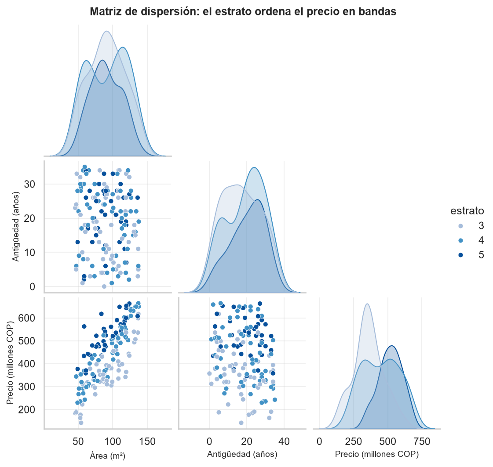
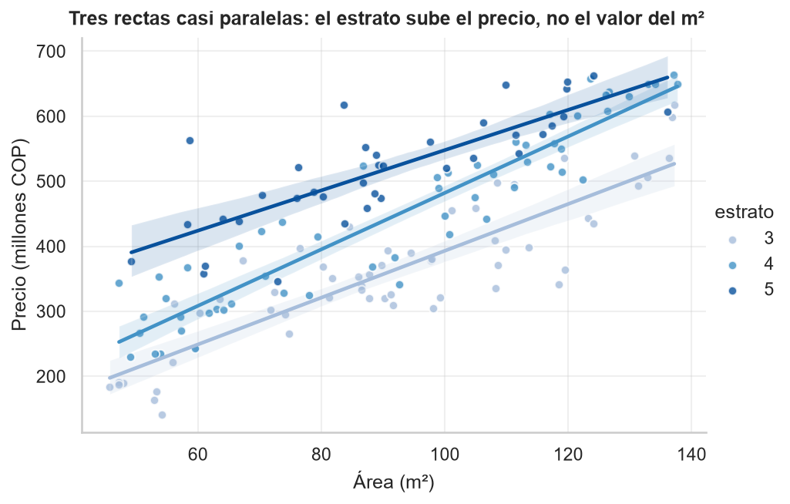
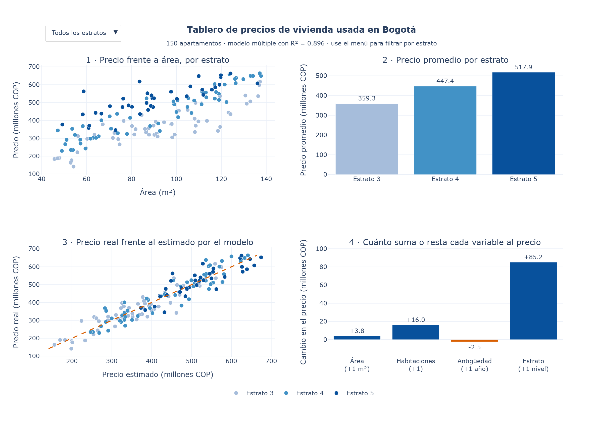
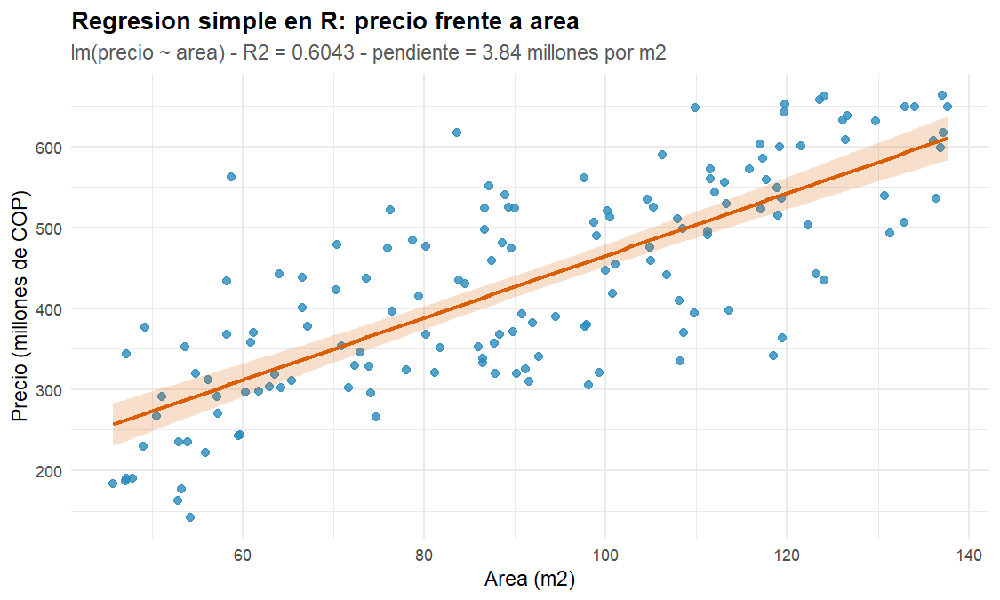
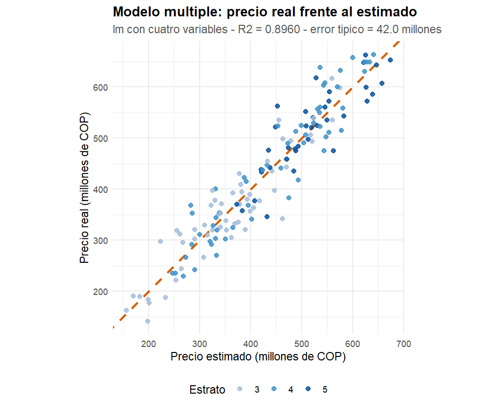
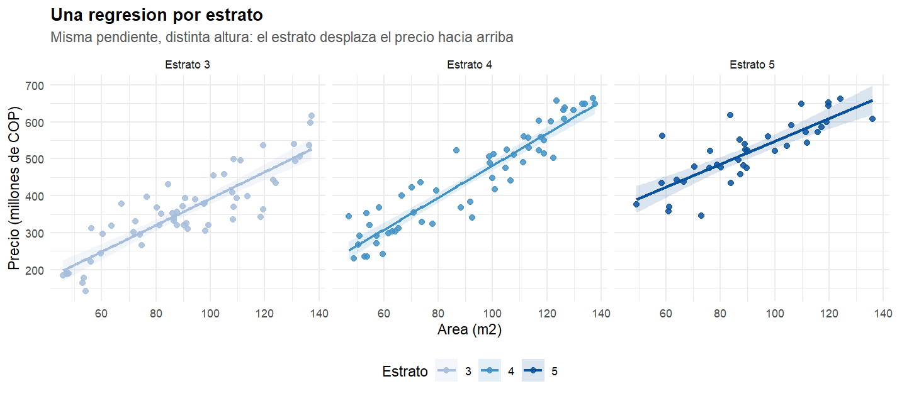

<div align="center">
    
</div>

# Análisis de regresión y visualización avanzada

## 📋 Información General

<div align="center">
    
</div>

| Aspecto | Detalles |
|--------|----------|
| **Autor** | Andrés Giovanny Rubiano Muñoz "Andy Rubiano" |
| **Correo** | arubiano67@unisalle.edu.co |
| **Asignatura** | Ciencia de Datos |
| **Docente** | Fabián Camilo Castro Riveros |
| **Actividad** | Actividad 4 · Análisis de Regresión y Visualización Avanzada |
| **Unidad** | Unidad 2 · Herramientas de visualización avanzada |
| **Programa** | Maestría en Inteligencia Artificial |
| **Universidad** | Universidad de La Salle |
| **Líneas de Trabajo** | Regresión Lineal Simple y Múltiple, Validación Predictiva y Visualización Avanzada |
| **Año** | 2026 |
| **Estado** | Completado |

---

## 🎯 Descripción del Proyecto

Este repositorio contiene **el informe en LaTeX** (formato IEEE conference) del laboratorio de regresión y visualización avanzada.

El informe responde una sola pregunta: **¿qué determina el precio de un apartamento usado y con cuánta precisión se puede estimar?** El análisis parte de 150 apartamentos de Bogotá descritos por cuatro características —área, habitaciones, antigüedad y estrato—, ajusta primero una regresión simple sobre el área y después una regresión múltiple sobre las cuatro variables, valida el resultado sobre datos no vistos y lo verifica de forma independiente en R.

### El hallazgo central

> **La correlación bivariada puede esconder un efecto real.** El número de habitaciones no muestra asociación con el precio al medirse de forma aislada (r = 0,0807; p = 0,326) y sin embargo resulta altamente significativo en el modelo múltiple (+16,0 millones de pesos por habitación; p = 9,2 × 10⁻⁶). No cambian los datos, cambia la pregunta: comparar apartamentos *cualesquiera* no es lo mismo que comparar apartamentos *equivalentes*.

> **El modelo múltiple reduce el error a la mitad.** El coeficiente de determinación pasa de 0,6043 a 0,8960 y el error medio de estimación baja de 66,7 a 33,1 millones de pesos.

> **Los coeficientes son accionables.** Traducidos a metros cuadrados equivalentes: una habitación vale 4,2 m², un nivel de estrato vale 22,4 m² y cada década de antigüedad cuesta 6,5 m².

### Objetivos Principales

- Medir la asociación de cada característica con el precio y ajustar la regresión lineal simple con `statsmodels`.
- Estimar la regresión múltiple e interpretar cada coeficiente **manteniendo constantes las demás variables**.
- Comparar ambos modelos con R², R² ajustado, RMSE, MAE y el criterio de Akaike.
- Validar la capacidad predictiva sobre datos no vistos con `scikit-learn` (partición 70/30 y validación cruzada de 5 pliegues).
- Construir visualizaciones que **formen parte del argumento** y no lo ilustren, incluidas dos piezas interactivas.
- Verificar todo el cálculo con una implementación independiente en R.
- Entregar el informe escrito aplicando la normativa IEEE.

---

## 📚 Estructura del Repositorio

```
.
├── main.tex                          # Documento principal (preámbulo + \input de secciones y apéndices)
├── IEEEtran.cls                      # Clase LaTeX del formato IEEE conference
├── README.md                         # Este archivo
├── assets/
│   └── images/
│       ├── Logo.png                  # Logo institucional (marca de agua)
│       ├── author/                   # Fotografía del autor
│       └── figures/                  # Figuras generadas por los scripts
│           ├── python/
│           │   ├── regression/       # Fases 2-3 (Matplotlib) — 4 figuras
│           │   │   ├── ajuste_simple.png              # Fig. 3  · recta MCO con banda de confianza
│           │   │   ├── efecto_variables.png           # Fig. 4  · coeficientes con IC 95 %
│           │   │   ├── comparacion_residuos.png       # Fig. 5  · errores en la misma escala
│           │   │   └── validacion_sklearn.png         # Fig. 6  · prueba retenida y pliegues
│           │   ├── advanced/         # Fase 4 (seaborn) — 3 figuras
│           │   │   ├── sns_heatmap_correlacion.png    # Fig. 1  · matriz de correlaciones
│           │   │   ├── sns_matriz_dispersion.png      # Fig. 2  · matriz de dispersión
│           │   │   └── sns_ajuste_por_estrato.png     # Fig. 7  · una regresión por estrato
│           │   └── dashboard/        # Fase 4 (Plotly) — capturas de las piezas interactivas
│           │       ├── dashboard.png                  # Fig. 8  · tablero de cuatro paneles
│           │       └── dispersion_interactiva.png     # Fig. 9  · dispersión explorable
│           └── r/                    # Fase 5 (ggplot2) — 3 figuras
│               ├── ggplot_ajuste_simple.png           # Fig. 10 · ajuste simple en R
│               ├── ggplot_real_vs_estimado.png        # Fig. 11 · real frente a estimado
│               └── ggplot_facetas_estrato.png         # Fig. 12 · un panel por estrato
├── src/
│   ├── sections/                     # Secciones del informe (en orden de compilación)
│   │   ├── introduction/             # I. Introducción
│   │   ├── methodology/              # II. Metodología
│   │   ├── results/                  # III. Resultados
│   │   └── conclusions/              # IV. Conclusiones
│   └── appendices/
│       ├── python-code/              # Apéndice A: los cuatro scripts de Python
│       └── r-code/                   # Apéndice B: el script de R
├── utils/
│   ├── codes/                        # Copias citadas vía \lstinputlisting
│   │   ├── python/
│   │   │   ├── dataset.py                     # Fase 1
│   │   │   ├── regression.py                  # Fase 2
│   │   │   ├── validation.py                  # Fase 3
│   │   │   └── visualization.py               # Fase 4
│   │   └── r/
│   │       └── regression.R                   # Fase 5
│   └── references/
│       └── references.bib            # Bibliografía IEEE (18 referencias citadas)
└── build/                            # Artefactos de compilación LaTeX (generado)
```

> ℹ️ Los scripts, el dataset y las figuras se generan en el proyecto hermano [`regression-analysis-and-advanced-visualization`](../regression-analysis-and-advanced-visualization); este repositorio contiene únicamente el informe y las copias citadas desde él.

### Estructura del informe

| # | Sección | Contenido |
|---|---|---|
| — | Resumen y palabras clave | Cifras principales del estudio |
| I | Introducción | El problema de la correlación bivariada, el conjunto de datos y anticipo del hallazgo central |
| II | Metodología | Conjunto de datos (**Tabla I**), los dos modelos con las once medidas y sus fórmulas (**Tabla II**), los esquemas de validación y las cinco fases del flujo (**Tabla III**) |
| III | Resultados | Correlación (**Tabla IV**, **Figs. 1–2**), regresión simple (**Tabla V**, **Fig. 3**), regresión múltiple (**Tabla VI**, **Fig. 4**), comparación de modelos (**Tabla VII**, **Fig. 5**), validación (**Tabla VIII**, **Fig. 6**), visualización avanzada (**Figs. 7–9**) y verificación en R (**Tabla IX**, **Figs. 10–12**) |
| IV | Conclusiones | Siete conclusiones respaldadas por las cifras de la ejecución |
| A | Apéndice · Código en Python | `dataset.py`, `regression.py`, `validation.py` y `visualization.py` |
| B | Apéndice · Código en R | `regression.R` |
| — | Referencias | 18 entradas en formato IEEE |

**El cuerpo del informe no lleva listados de código.** La metodología describe cada decisión de implementación y remite a los Apéndices A y B, donde los cinco scripts se reproducen en su orden de ejecución.

---

## 🧪 Metodología

### Los dos modelos

| Modelo | Especificación | Qué añade |
|---|---|---|
| **Simple** | precio ~ área | Referencia; usa la variable más correlacionada con la respuesta |
| **Múltiple** | precio ~ área + habitaciones + antigüedad + estrato | Aísla el efecto propio de cada característica |

El estrato se trata como **variable ordinal** y no como categórica, porque sus tres niveles son consecutivos y su efecto sobre el precio se supone constante entre niveles. Esto evita las variables indicadoras y mantiene el modelo en su forma más simple: cuatro regresores numéricos, sin interacciones.

### Las medidas empleadas (Tabla II del informe)

| Medida | Fórmula | Qué aporta |
|---|---|---|
| Correlación de Pearson | *r* = Σ(*xᵢ*−*x̄*)(*yᵢ*−*ȳ*) / √[Σ(*xᵢ*−*x̄*)² Σ(*yᵢ*−*ȳ*)²] | Asociación lineal entre dos variables, **sin controlar por ninguna otra** |
| Regresión lineal simple | *yᵢ* = *β₀* + *β₁xᵢ* + *εᵢ* | Descompone el precio en parte lineal y error |
| Criterio de mínimos cuadrados | mín Σ(*yᵢ* − *β₀* − *β₁xᵢ*)² | Elige la recta que minimiza los residuos al cuadrado |
| Estimadores | *β̂₁* = Σ(*xᵢ*−*x̄*)(*yᵢ*−*ȳ*)/Σ(*xᵢ*−*x̄*)²,  *β̂₀* = *ȳ* − *β̂₁x̄* | Solución cerrada, sin búsqueda numérica |
| Regresión lineal múltiple | *yᵢ* = *β₀* + *β₁x₁ᵢ* + *β₂x₂ᵢ* + *β₃x₃ᵢ* + *β₄x₄ᵢ* + *εᵢ* | Cada *βⱼ* mide su variable manteniendo constantes las demás |
| Coeficiente de determinación | *R²* = 1 − Σ(*yᵢ*−*ŷᵢ*)²/Σ(*yᵢ*−*ȳ*)² | Variabilidad del precio que el modelo explica |
| *R²* ajustado | *R²ₐⱼ* = 1 − (1−*R²*)(*n*−1)/(*n*−*k*−1) | Penaliza los parámetros que *R²* premia |
| Estadístico *t* e IC | *tⱼ* = *β̂ⱼ*/*ee*(*β̂ⱼ*),  *β̂ⱼ* ± *t*·*ee*(*β̂ⱼ*) | Un coeficiente es significativo si su IC no contiene al cero |
| RMSE | √[(1/*n*) Σ(*yᵢ*−*ŷᵢ*)²] | Error medio en millones de pesos |
| MAE | (1/*n*) Σ\|*yᵢ*−*ŷᵢ*\| | Igual, sin penalizar de más los errores grandes |
| Criterio de Akaike | AIC = −2 ln *L* + 2*k* | Equilibra ajuste y complejidad |

### Las cinco fases del flujo (Tabla III del informe)

| Fase | Script | Qué produce |
|---|---|---|
| 1 | `dataset.py` | Conjunto de datos reproducible de 150 apartamentos |
| 2 | `regression.py` | Correlaciones, modelo simple, modelo múltiple, comparación y 3 figuras |
| 3 | `validation.py` | Partición 70/30, validación cruzada de 5 pliegues y 1 figura |
| 4 | `visualization.py` | 3 figuras de seaborn y 2 piezas interactivas de Plotly |
| 5 | `regression.R` | Reestimación con `lm()`, verificación cruzada y 3 figuras |

Entorno: **Python 3.14** (statsmodels 0.14.6, scikit-learn 1.9.0, Matplotlib 3.11.1, seaborn 0.13.2, Plotly 6.9.0, sobre NumPy y pandas) y **R 4.6.1** con ggplot2. El reparto entre statsmodels y scikit-learn no es arbitrario: el primero entrega errores estándar, estadísticos *t* e intervalos de confianza; el segundo, la partición y la validación cruzada que aquel no tiene.

---

## 📊 Resultados

### Análisis de correlación (Tabla IV)

| Variable | Pearson *r* | p-valor | Lectura |
|---|---|---|---|
| **Área** | **0,7774** | 1,4 × 10⁻³¹ | Fuerte y positiva |
| Estrato | 0,4872 | 2,6 × 10⁻¹⁰ | Moderada |
| Antigüedad | −0,1946 | 0,017 | Débil y negativa |
| Habitaciones | 0,0807 | **0,326** | **No detectable** |

| | |
|---|---|
|  |  |
| **Figura 1 · Mapa de calor** (`seaborn`) — la antigüedad es la única variable que empuja el precio hacia abajo, y las cuatro características son prácticamente independientes entre sí | **Figura 2 · Matriz de dispersión** (`seaborn`) — el precio se ordena en bandas superpuestas según el estrato: para una misma área, el estrato superior queda por encima |

### Regresión simple (Tabla V)

**precio = 81,09 + 3,845 · área**, con R² = 0,6043. El área explica el 60,4 % de la variabilidad y deja sin explicar el 39,6 % restante; el error medio absoluto es de 66,7 millones de pesos.

<div align="center">
    
</div>

**Figura 3 · Ajuste por mínimos cuadrados** (`Matplotlib`) — la banda naranja es el intervalo de confianza al 95 % de la recta. La dispersión vertical de los puntos alrededor de ella es, visualmente, lo que las tres variables omitidas tendrán que explicar.

### Regresión múltiple (Tabla VI)

| Término | Coeficiente | Error estándar | *t* | p-valor |
|---|---|---|---|---|
| Intercepto | −237,026 | 24,137 | −9,82 | 9,2 × 10⁻¹⁸ |
| **Área** (por m²) | **+3,797** | 0,133 | 28,51 | 2,5 × 10⁻⁶¹ |
| **Habitaciones** (por unidad) | **+16,010** | 3,482 | 4,60 | 9,2 × 10⁻⁶ |
| **Antigüedad** (por año) | **−2,475** | 0,359 | −6,90 | 1,5 × 10⁻¹⁰ |
| **Estrato** (por nivel) | **+85,185** | 4,440 | 19,18 | 1,3 × 10⁻⁴¹ |

Las cuatro variables son significativas al 5 %, **incluida la que la correlación había descartado**.

<div align="center">
    
</div>

**Figura 4 · Efecto de cada variable** (`Matplotlib`) — ningún intervalo de confianza contiene al cero. Expresados en metros cuadrados equivalentes: una habitación vale 4,2 m², un nivel de estrato vale 22,4 m² y cada década de antigüedad cuesta 6,5 m².

### Comparación de modelos (Tabla VII)

| Modelo | Regresores | R² | R² ajustado | RMSE | MAE | AIC |
|---|---|---|---|---|---|---|
| Simple | 1 | 0,6043 | 0,6016 | 80,60 | 66,72 | 1 746,5 |
| **Múltiple** | 4 | **0,8960** | **0,8932** | **41,32** | **33,07** | **1 552,1** |

<div align="center">
    
</div>

**Figura 5 · Errores en la misma escala** (`Matplotlib`) — a la izquierda el modelo simple, con errores que llegan a ±250 millones; a la derecha el múltiple, con la nube visiblemente más estrecha. Ajustar la escala de cada panel a sus propios datos habría hecho parecer equivalentes dos situaciones que no lo son.

### Validación predictiva (Tabla VIII)

| Modelo | R² entrenamiento | R² prueba | RMSE prueba | MAE prueba | R² validación cruzada |
|---|---|---|---|---|---|
| Simple | 0,6135 | 0,5744 | 88,15 | 75,29 | 0,6041 ± 0,0620 |
| **Múltiple** | 0,8934 | **0,8955** | **43,69** | **34,75** | **0,8888 ± 0,0162** |

La brecha entre entrenamiento y prueba es de **−0,0021**: no hay sobreajuste. El modelo múltiple gana en los cinco pliegues y es cerca de **cuatro veces más estable** que el simple.

<div align="center">
    
</div>

**Figura 6 · Validación** (`scikit-learn` + `Matplotlib`) — a la izquierda, el precio real frente al predicho sobre los 45 apartamentos de prueba, contra la diagonal de predicción perfecta; a la derecha, el R² pliegue a pliegue, que muestra que la ventaja del modelo múltiple no fue suerte de una partición.

### Visualización avanzada (Figuras 7 a 9)

<div align="center">
    
</div>

**Figura 7 · `lmplot` por estrato** (`seaborn`) — tres rectas casi paralelas. Es el supuesto del modelo múltiple hecho gráfico: el estrato **desplaza** el precio hacia arriba sin cambiar cuánto vale el metro cuadrado dentro de cada nivel.

<div align="center">
    
</div>

**Figura 8 · Tablero interactivo** (`Plotly`) — cuatro paneles y un menú desplegable que filtra por estrato: el ajuste con la ficha de cada apartamento al pasar el cursor, el precio promedio por estrato (359,3 · 447,4 · 517,9 millones), el precio real frente al estimado y el efecto de cada variable. El HTML navegable vive en el proyecto hermano: [`dashboard.html`](../regression-analysis-and-advanced-visualization/public/assets/images/figures/python/dashboard/dashboard.html).

<div align="center">
    
</div>

**Figura 9 · Dispersión explorable** (`Plotly`) — codifica cuatro variables a la vez: área en el eje horizontal, precio en el vertical, estrato en el color y habitaciones en el tamaño del punto, con la línea de tendencia MCO. Versión navegable: [`dispersion_interactiva.html`](../regression-analysis-and-advanced-visualization/public/assets/images/figures/python/dashboard/dispersion_interactiva.html).

### Verificación cruzada Python ↔ R (Tabla IX)

`lm()` reproduce los cinco coeficientes con **diferencia máxima 0,000000**. El contraste F entre los dos modelos arroja **F = 135,63** con p < 2,2 × 10⁻¹⁶.

| | |
|---|---|
|  |  |
| **Figura 10 · `geom_smooth(method = "lm")`** — la gramática de gráficos declara el ajuste como una capa más, con su banda de confianza incluida | **Figura 11 · Precio real frente al estimado** — la diagonal es la predicción perfecta; el error típico del modelo es de 42,0 millones |

<div align="center">
    
</div>

**Figura 12 · `facet_wrap` por estrato** (`ggplot2`) — la misma idea del `lmplot` de seaborn resuelta con la gramática de ggplot2: un panel por estrato, misma pendiente, distinta altura.

---

## ⚙️ Requisitos

### Para compilar el documento LaTeX

- Distribución **MiKTeX** (Windows) o **TeX Live** (Linux/macOS) con `pdflatex` y `bibtex`.
- Paquetes: `IEEEtran` (incluido en el repositorio), `babel` con opción `spanish`, `amsmath`, `graphicx`, `array`, `listings`, `xcolor`, `float`, `tcolorbox`, `eso-pic`, `transparent`, `capt-of`, `cuted` y `hyperref`.
- Recomendado: `latexmk` para automatizar los pases de compilación y de bibliografía.

### Para ejecutar los scripts

Los scripts se ejecutan en el proyecto hermano; aquí solo se citan como listados. Si se quieren regenerar las figuras:

- **Python 3.10+** (probado en 3.14.7) con `statsmodels`, `scikit-learn`, `matplotlib`, `seaborn`, `plotly`, `kaleido`, `numpy`, `pandas` y `scipy`.
- **R 4.x** (probado en 4.6.1) con `ggplot2`.

---

## 🛠️ Compilación del Documento

### Opción 1: `latexmk` (recomendado)

```bash
latexmk -pdf -interaction=nonstopmode -outdir=build main.tex
```

### Opción 2: `pdflatex` manual

La bibliografía necesita cuatro pases:

```bash
pdflatex -interaction=nonstopmode -output-directory=build main.tex
bibtex   build/main
pdflatex -interaction=nonstopmode -output-directory=build main.tex
pdflatex -interaction=nonstopmode -output-directory=build main.tex
```

El PDF queda en `build/main.pdf`.

### Limpiar artefactos temporales

```bash
latexmk -C -outdir=build       # o simplemente: rm -rf build
```

---

## 🎨 Configuración del Documento

### Ancho completo sin flotar: el entorno `strip`

El documento **no usa `figure*` ni `table*`**. La razón es que ambos solo admiten la posición `t` (tope de página) o `p` (página de flotantes) —**nunca `h` ni `b`**—, de modo que el material ancho se despegaba del párrafo que lo cita y aparecía una o dos páginas más adelante, rompiendo el orden narrativo.

En su lugar, todo lo que necesita ancho completo usa el entorno `strip` de `cuted`, que ocupa las dos columnas **en su posición exacta del flujo de texto**:

| Elemento | Entorno |
|---|---|
| Tablas **II**, **VI** y **VIII** | `strip` + `\captionof{table}` |
| Figuras **5**, **6**, **8** y **12** | `strip` + `\captionof{figure}` |
| Tablas **I**, **IV**, **V**, **VII**, **IX** | `table[H]` a una columna |
| Figuras **1**, **2**, **3**, **4**, **7**, **9**, **10**, **11** | `figure[H]` a una columna |

Tres reglas aprendidas al aplicarlo:

1. **`\caption` no funciona dentro de un `strip`** (no es un flotante): hay que usar `\captionof{table}` o `\captionof{figure}`, de `capt-of`. Y el `\label` debe ir **justo después** del `\captionof`, no al final del bloque.
2. **Si el bloque no cabe en lo que resta de página, hay que anteponerle `\clearpage`.** Suele avisarlo `cuted` con `Optional argument of \twocolumn too tall`, pero **no siempre**: la Figura 6 compilaba sin una sola advertencia y aun así quedaba cortada al pie de una página con su pie de figura huérfano en la siguiente. Hay que mirar el PDF, no solo el log.
3. El coste de cada `\clearpage` es una página parcialmente vacía, así que conviene reservarlo para el material que de verdad lo necesita.

Los parámetros de flotantes se conservan porque siguen gobernando la colocación de `[H]` y de las páginas de flotantes:

```latex
\renewcommand{\topfraction}{0.92}
\renewcommand{\textfraction}{0.06}
\renewcommand{\floatpagefraction}{0.72}
\renewcommand{\dbltopfraction}{0.92}
\renewcommand{\dblfloatpagefraction}{0.72}
\setcounter{topnumber}{3}
\setcounter{dbltopnumber}{3}
\setcounter{totalnumber}{5}
```

### Listados de código: longitud de línea

Con `basicstyle=\ttfamily\scriptsize` una columna IEEE admite unos **65 caracteres** por línea. `breaklines=true` parte las líneas largas de código, pero **no puede partir una secuencia continua de guiones**, así que los scripts no usan reglas de comentario del tipo `# ------` a ancho completo: cada una producía un `Overfull \hbox` de 83 pt. Las cabeceras de bloque son comentarios de texto normal.

```latex
\lstset{
    breaklines=true,
    breakatwhitespace=false,
    breakautoindent=false,   % la continuación se alinea al margen, no a la sangría original
    breakindent=0pt,
}
```

### Caracteres no ASCII en el código fuente

El bloque `literate` cubre tildes, `ñ`/`Ñ`, **`ü`/`Ü`** (necesaria por «antigüedad», que aparece en casi todos los scripts) y los símbolos que salen en comentarios y etiquetas de gráficos: `²`, `·`, `¿`, `×`, `−`, `—`, `–`. Sin esas entradas, `inputenc` aborta la compilación con `Invalid UTF-8 byte sequence`.

```latex
literate=
    {á}{{\'a}}1 {é}{{\'e}}1 {í}{{\'i}}1 {ó}{{\'o}}1 {ú}{{\'u}}1
    {ñ}{{\~n}}1 {Ñ}{{\~N}}1
    {ü}{{\"u}}1 {Ü}{{\"U}}1
    {²}{{$^{2}$}}1 {·}{{\textperiodcentered}}1 {¿}{{\textquestiondown}}1
    ...
```

### Tablas anchas: `\tabcolsep`

La Tabla **II** (fórmulas) es la más ancha del informe. En lugar de reducir el cuerpo de letra, que rompería la uniformidad tipográfica, se estrecha la separación entre columnas dentro del entorno:

```latex
\setlength{\tabcolsep}{4pt}
\begin{tabular}{|>{\raggedright\arraybackslash}p{3.3cm}|c|>{\raggedright\arraybackslash}p{5.2cm}|}
```

`\arraybackslash` es obligatorio: `\raggedright` redefine `\\`, y sin restaurarlo el salto de fila deja de funcionar dentro de esa columna.

### Símbolo de porcentaje dentro de ecuaciones

`babel` con opción `spanish` redefine `\%` mediante `\es@sppercent`, que inspecciona `\lastskip`. En modo matemático el último *skip* es un `muskip`, lo que provoca `Incompatible glue units`:

```latex
% ✗ falla:  100\,\%
% ✓ correcto:
100\,\text{\%}
```

### Cursivas dentro de los pies de tabla

IEEEtran compone los pies de tabla en **versalitas**, y la familia Times no tiene forma versalita-cursiva: un `\textit{}` dentro de un `\caption` de tabla dispara `Font shape OT1/ptm/m/scit undefined`. Los nombres de librerías van sin cursiva en esos pies.

### Etiquetas en español

`babel` reasigna `\tablename` a *Cuadro* al iniciar el documento, por lo que un `\renewcommand` en el preámbulo **no basta**: debe inyectarse dentro de `\captionsspanish`.

```latex
\addto\captionsspanish{%
    \renewcommand{\tablename}{Tabla}%
    \renewcommand{\lstlistingname}{Código}%
}
```

### Marca de agua institucional

Aparece en todas las páginas, dibujada en la capa de fondo (`\AddToShipoutPictureBG` de `eso-pic`), por detrás del texto y de las figuras. La controla el flag `\ifshowwatermark`; basta cambiar `\showwatermarktrue` por `\showwatermarkfalse` para desactivarla.

### Convención de etiquetas (`\label`)

| Elemento | Ejemplos |
|---|---|
| Tablas | `dataset_variables`, `measures`, `workflow`, `correlations`, `coef_simple`, `coef_multiple`, `model_comparison`, `ml_validation`, `cross_check` |
| Figuras | `heatmap`, `scatter_matrix`, `fit_simple`, `effects`, `residuals_comparison`, `validation_fig`, `lmplot`, `dashboard`, `scatter_plotly`, `ggplot_fit`, `ggplot_facets`, `ggplot_pred` |
| Apéndices | `anexo_python`, `anexo_r` |

---

## 📋 Estado del Documento

El informe está **terminado**: compila en 17 páginas **sin errores, sin desbordes de caja y sin referencias ni citas sin resolver**; todas las figuras y tablas están referenciadas desde el texto.

### ✅ Completado

#### Secciones
- ✅ **Resumen** — con las cifras principales del estudio
- ✅ **Introducción** — el problema de la correlación bivariada y anticipo del hallazgo central
- ✅ **Metodología** — conjunto de datos, los dos modelos, las once medidas con sus fórmulas, los esquemas de validación y las cinco fases del flujo
- ✅ **Resultados** — correlación, regresión simple, regresión múltiple, comparación de modelos, validación predictiva, visualización avanzada y verificación en R
- ✅ **Conclusiones** — siete conclusiones respaldadas por las cifras de la ejecución

#### Apéndices
- ✅ **Apéndice A** — los cuatro scripts de Python, en su orden de ejecución
- ✅ **Apéndice B** — `regression.R`

#### Infraestructura
- ✅ 5 scripts en `utils/codes/` (copias del repositorio hermano)
- ✅ 12 imágenes, todas referenciadas desde el texto
- ✅ 9 tablas con las cifras reales de la ejecución
- ✅ Bibliografía IEEE (18 referencias citadas en `utils/references/references.bib`)
- ✅ Etiquetas en español (Tabla, Código) vía `\captionsspanish`
- ✅ Marca de agua institucional en todas las páginas, con flag de activación
- ✅ Resaltado de sintaxis diferenciado para Python y R
- ✅ Compilación sin `Overfull` ni `Underfull \hbox`/`\vbox`

---

## 📖 Guía de Estilo

| Aspecto | Valor |
|---|---|
| Idioma | Español |
| Formato | IEEE conference (`IEEEtran`, dos columnas) |
| Tamaño de página | Carta (8.5" × 11") |
| Fuente base | 10 pt |
| Bibliografía | IEEE |
| Extensión | 17 páginas |

---

## 🔑 Palabras Clave

`Coeficiente de Determinación` · `ggplot2` · `Matplotlib` · `Plotly` · `Regresión Lineal Múltiple` · `Regresión Lineal Simple` · `scikit-learn` · `seaborn` · `statsmodels` · `Tablero Interactivo` · `Validación Cruzada` · `Visualización Avanzada`

---

## 🔗 Recursos

- [Proyecto hermano `regression-analysis-and-advanced-visualization` — scripts, dataset y figuras](../regression-analysis-and-advanced-visualization)
- [Documentación de statsmodels](https://www.statsmodels.org/stable/)
- [Documentación de scikit-learn](https://scikit-learn.org/stable/)
- [Documentación de seaborn](https://seaborn.pydata.org/)
- [Documentación de Plotly](https://plotly.com/python/)
- [Documentación de ggplot2](https://ggplot2.tidyverse.org/)
- [The R Project for Statistical Computing](https://www.R-project.org/)
- [Documentación LaTeX](https://www.latex-project.org/)
- [Paquete listings](https://www.ctan.org/pkg/listings)

---

## 📧 Contacto

**Andrés Giovanny Rubiano Muñoz**
Maestría en Inteligencia Artificial · Universidad de La Salle
arubiano67@unisalle.edu.co

---

## 📄 Derechos Reservados

© 2026 Andrés Giovanny Rubiano Muñoz (Andy Rubiano). Todos los derechos reservados.

Este trabajo académico y su contenido —investigación, código, metodologías y documentación— son propiedad intelectual conjunta de:

- **Andrés Giovanny Rubiano Muñoz** (Andy Rubiano) — Autor
- **Universidad de La Salle** — Institución académica

El uso, reproducción o distribución requiere autorización previa escrita de los titulares de derechos.

---

<div align="center">
  Universidad de La Salle | Bogotá D. C., Colombia
</div>
